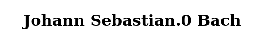
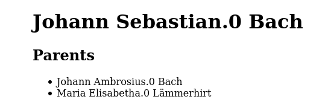
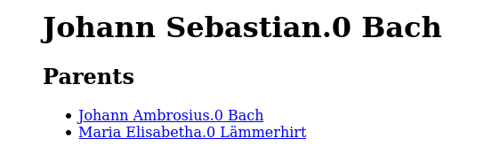
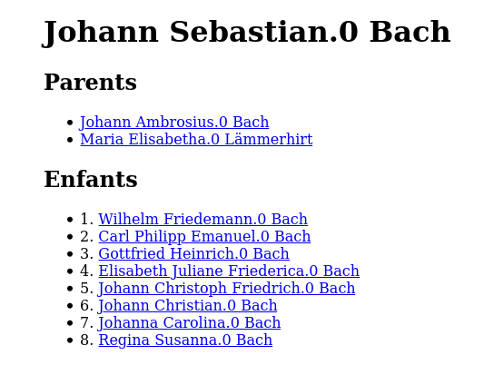

# Écrire un template avec jingoo

`gwd` gère un mode `m=SANDBOX` qui va afficher `SANDBOX.html.jingoo`
en utilisant l'environnement par defaut. Nous allons utiliser cette page
pour écrire un premier template. Il s'agira d'une page, intégrée dans une
page "squelette", qui affichera le *prénom.occ nom* d'une personne,
ainsi que ceux de ses parents et enfants.

## Le squelette

Nous allons commencer par écrire une page qui définie la structure globale
de nos pages

`'SANDBOX_skeleton.html.jingoo'`
```jinja2
<!DOCTYPE html>
<html lang="en">
  <head>
    <meta charset="utf-8">
    <title>Default title page</title>
    <style>body {width:max-content;margin:auto;}</style>
  </head>
  <body>
    <!-- page content -->
  </body>
</html>
```

Il s'agit de la structure que partageront toutes nos pages.
La personnalisation de la page se fera grâce aux balises ``.
Voyons cela avec le prochain template.

### Étendre une page

Écrivons maintenant notre page qui hérite de cette structure de base

```jinja2

```

La balise `` permet d'integrer notre page à l'intérieur
d'un template parent.
`SANDBOX.html.jingoo`

```jinja2

GeneWeb's SANDBOX page
```

Lorsque l'on défini un block qui existe également dans le template
parent, le contenur de ce dernier est remplacé par le contenu de celui
que nous redéfinissons dans le template qui hérite de ce parent.

Si vous ne redéfinissez pas un block, le contenu du block parent
sera utilisé. Ici, si nous ne redéfinissons pas ``,
le titre de notre page sera donc `Default title page`.

```jinja2

GeneWeb's SANDBOX page

  
    <form method="get" action="{{ conf.command }}">
      <input type="hidden" name="m" value="SANDBOX">
      <input type="text" name="i" value="" size="2">
    </form>
  

```

Ici, les choses deviennent un peu plus intéressante. Dans le block `body`,
nous commençons par tester si `conf.env.i` est défini.

Si ce n'est pas le cas, un formulaire est utilisé pour recharger la même
page, avec un `i` défini par l'utilisateur. `i` représente l'identifiant
d'une personne, comme lorsque vous affichez le formulaire d'édition.


```jinja2

GeneWeb's SANDBOX page

  
    <form method="get" action="{{ conf.command }}">
      <input type="hidden" name="m" value="SANDBOX">
      <input type="text" name="i" value="" size="2">
    </form>
  
    
    
  

```

Si `i` est défini, alors on récupère la personne correspondant à cet
identifiant, et on l'assigne à la variable `person`, grâce à
``.

Une fois cette variable défini, nous pouvons inclure un morceau de page,
qui s'attend à se que `person` soit défini avant d'être appelé grâce à
``. Comme son nom l'indique
assez bien, cette instruction se charge en faite de copier le contenu
de `SANDBOX_person.html.jingoo`, et de le coller ici.

### Les macros, l'utilisation du lexicon

Passons donc à cette page, que nous venons d'inclure.

La première chose que nous ferons est d'afficher le *prénom.occ nom*
de la personne dont on veut afficher la page.

```jinja2
{# This page expects that `person` is defined in the context. #}

<h1>{{ person.first_name }}.{{ person.occ }} {{ person.surname }}</h1>
```



Ensuite, affichons aussi ses parents. Afin de nous faciliter la tâche,
nous allons définir une macro `fos` pour afficher les infos d'une personne.

```jinja2
{# This page expects that `person` is defined in the context. #}


  {{ p.first_name }}.{{ p.occ }} {{ p.surname }}


<h1>{{ fos (person) }}</h1>

<h2>{{ 'parents' | trans | capitalize }}</h2>


  <ul>
    <li>{{ fos (person.father) }}</li>
    <li>{{ fos (person.mother) }}</li>
  </ul>

  <p>{{ 'missing ancestors' | trans | capitalize }}</p>

```



Notons que l'utilisation d'un élément présent dans le lexicon se fait
avec l'application de la fonction (aussi appelé filtre) `trans`.

Afin de pouvoir visiter la page des autres personnes présente sur la page,
nous allons définir une autre macro, qui appelera la première mais qui
ajoutera un lien vers la page adéquate.

```jinja2
{# This page expects that `person` is defined in the context. #}


  {{ p.first_name }}.{{ p.occ }} {{ p.surname }}



  <a href="{{ env.prefix }}m=SANDBOX&i={{ p.iper }}">{{ fos (p) }}</a>


<h1>{{ fos (person) }}</h1>

<h2>{{ 'parents' | trans | capitalize }}</h2>


  <ul>
    <li>{{ fos_link (person.father) }}</li>
    <li>{{ fos_link (person.mother) }}</li>
  </ul>

  <p>{{ 'missing ancestors' | trans | capitalize }}</p>

```


### Une boucle `for`

Maintenant, affichons ses enfant, si la personne en a. Le champ
`person.children` est une liste, sur laquelle nous pouvons itérer grâce
à l'instruction ``

```jinja2
{# This page expects that `person` is defined in the context. #}


  {{ p.first_name }}.{{ p.occ }} {{ p.surname }}



  <a href="{{ env.prefix }}m=SANDBOX&i={{ p.iper }}">{{ fos (p) }}</a>


<h1>{{ fos (person) }}</h1>

<h2>{{ 'parents' | trans | capitalize }}</h2>


  <ul>
    <li>{{ fos_link (person.father) }}</li>
    <li>{{ fos_link (person.mother) }}</li>
  </ul>

  <p>{{ 'missing ancestors' | trans | capitalize }}</p>



  <h2>{{ 'child/children'| trans (length(person.children) > 1 ? 1 : 0) | capitalize }}</h2>
  <ul>
    
      <li>{{ loop.index }}. {{ fos_link (c) }}</li>
    
  </ul>

```



La variable `loop` est une variable définie automatique lors d'une boucle.
Pour ce qui est de l'utilisation de la traduction de ce cas,
nous allons choisir le pluriel de `child/children` si nous avons plus de
un enfant, et le singulier dans le cas contraire.

## Pour aller plus loin

Nous venons donc d'écrire un début de template, mettant en avant certaines
notions clés, mais nous avons à peine effleuré la surface de ce que nous
permet le nouveau moteur de template.

Pour retrouver la documentation complète du langage Jingoo, rendez-vous
[ici](http://tategakibunko.github.io/jingoo/templates/templates.fr.html)

Jingoo est très fortement inspiré d'un autre langage de template,
[jinja](https://jinja.palletsprojects.com/en/2.11.x/templates/), dont
la documentation est bien plus complète. En se basant sur la documentation
ou des tutoriels de jingoo, il y a fort à parier que cela puisse se
transposer sans modification sur jingoo.

Enfin, pour savoir ce qu'offre l'environnement et les structures de données
offert par GeneWeb, allez jeter un oeil sur la documentation de la
sous-bibliothèque [gwxjg](https://github.com/geneweb/geneweb/tree/merge-gnt-2/lib/gwxjg/README.MD).
