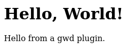

# L'utilisation des plugins pour GWD

*La toute dernière fonctionnalité ajoutée dans gwd
permet d'ajouter des modules à gwd. Voici les
explications*

## Écrire un *handler*

Un *handler* est une fonction qui va prendre
trois arguments : lui-même, la configuration,
et la base utilisée.

À partir de ces arguments, on effectue les actions voulues
et on affiche le résultat, en utilisant le module `Wserver`.

Par exemple, voici un *handler* qui récupère un paramêtre GET `n`,
et qui l'utilise pour afficher un message d'accueil.

```ocaml
let handler _self conf _base =
  Wserver.printf
    "<html>\
     <head>\
     <title>Hello!</title>\
     </head>\
     <body>\
     <h1>Hello, %s!</h1>\
     <p>Hello from a gwd plugin.</p>\
     </body>\
     </html>"
    (List.assoc "n" conf.Config.env)
```

## Enregistrer son plugin auprès de GWD

`gwd` fourni un module `GwdPlugin`, qui permet d'enregistrer
son plugin pour qu'il soit appelé lorsqu'une url avec le mode
(paramètre `m`) correspondant est demandée.

```ocaml
let () = Gwdlib.GwdPlugin.register "HELLO" handler
```

## Compiler le plugin

Pour pouvoir utiliser notre plugin, il faut fournir à
gwd un fichier `.cmxs`.

En utilisant [dune](https://dune.build/), il suffit d'écire
le fichier `dune` suivant.

```
(executable
  (name hello)
  (libraries geneweb-gwd-lib geneweb-wserver)
  (modes (native plugin))
)
```

Avec le stanza `(modes (native plugin))`, dune va nous produire
le fichier requis.

```
$ ls _build/default/plugins/hello/
dune  hello.cmxs  hello.ml
```

## Lancer gwd en lui indiquant le(s) plugin(s) à utiliser

Ensuite, il suffit de lancer gwd comme ceci

```
gwd.exe -bd bases/ -hd hd/ -plugin /path/to/hello.cmxs
```

Et en se rendant sur l'url http://localhost:2317/base_w?m=HELLO&n=World
nous obtenons :


